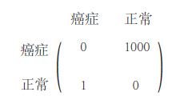
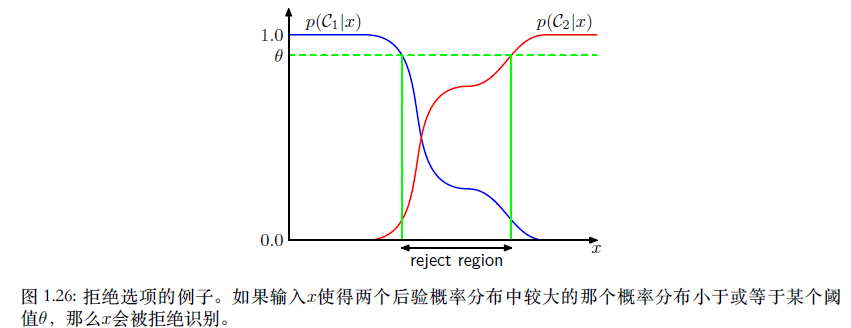
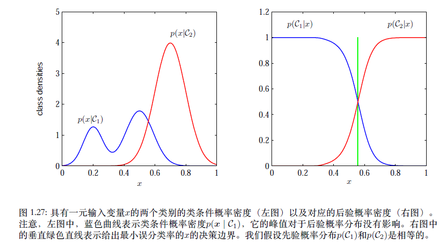
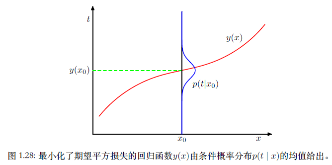
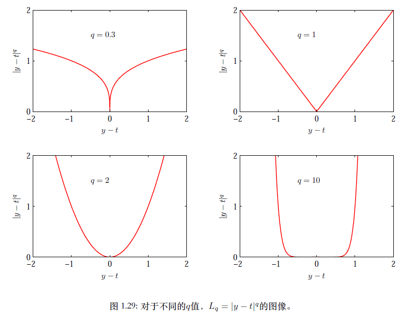

# PRML 1.5 决策论

- [PRML 1.5 决策论](#PRML-15-决策论)
	- [1.5.1 最小化错误分类率(Minimizing the misclassification rate](#151-最小化错误分类率Minimizing-the-misclassification-rate)
	- [1.5.2 最小化期望损失(Minimizing the expected loss)](#152-最小化期望损失Minimizing-the-expected-loss)
	- [1.5.3 拒绝选项(The reject option)](#153-拒绝选项The-reject-option)
	- [1.5.4 推断和决策](#154-推断和决策)
	- [1.5.5 回归问题中的损失函数](#155-回归问题中的损失函数)

---

## 1.5.1 最小化错误分类率(Minimizing the misclassification rate)

对监督学习中的分类问题来讲，我们需要一个“规则”，把每一个$x$分到合适的类别中去。这个“规则”会把输入空间分成不同的区域，这种区域叫做决策区域(decision region)，而决策区域的边界叫做决策边界或者叫决策面。如上图所示，如果我们将属于$C_1$类的值分到了$C_2$类中，那么我们就犯了一个错误。这种发生的概率如下：
$$
p(mistake) = p(x\in R_1, C_2)+p(x\in R_2, C_1)=\int_{R_1}p(x,C_2)\mathrm{d} x+\int_{R_2}p(x,C_1)\mathrm{d} x
$$

我们当然希望将错误降到最小，即最小化$p(mistake)$。根据乘积规则，

$$
p(x, C_k)=p(C_k|x)p(x)
$$
对最小化$p(x, C_k)$，那么需要最小化$p(C_k|x)$。

对于更⼀般的K类的情形，最大化正确率会稍微简单⼀些，即最大化下式

$$
p ( correct )
  =\sum_{k=1}^Kp ( \text{x}\in\mathcal{R}_k,\mathcal{C}_k )
  =\sum_{k=1}^K\int_{\mathcal{R}_k} p ( \text{x},\mathcal{C}_k ) \text{dx}
$$

## 1.5.2 最小化期望损失(Minimizing the expected loss)

书中举了一个对癌症病人分类的例子，我这里简单阐述一下。分类问题我们都会出现两种错误。一，给没有患癌症的病人错误地诊断为癌症，二、给患了癌症的病人诊断为健康。我们给出如下混淆矩阵：

接着，我们引出损失矩阵(loss matrix)，例如癌症这个例子，作者自己定义了一个损失矩阵，如下所示

如上图所示，我们将正常人诊断为癌症的错误**损失**记为1，而将癌症诊断为正常的错误**损失**记为1000。常见的损失函数如下所示

(1)  0-1损失函数
$$
L(Y,f(X))=\{ \begin{array}{c}1, Y\neq f(X) \\ {0}, Y= f(X)\end{array}.
$$

(2) 平方损失函数
$$
L(Y,f(X))=(Y-f(X))^2
$$

(3) 绝对损失函数
$$
L(Y,f(X))=|Y-f(X)|
$$

(4)对数损失函数
$$
L(Y,P(Y|X))=-logP(Y|X)
$$

## 1.5.3 拒绝选项(The reject option)

例如，在我们假想的医疗例⼦中，⼀种合适的做法是，使⽤⾃动化的系统来对那些⼏乎没有疑问的X光片进行分类，然后把不容易分类的X光片留给医学专家。为了达到这个目的，我们引入一个阈值$\theta$拒绝后验概率$p(C_k|x)$的最大值小于等于$\theta$的那些样本。

## 1.5.4 推断和决策

接着下面讲了**生成式模型(generative models)**、**判别式模型(discriminative models)**、**异常检测(novelty detection)**

**(a) 生成式模型(generative models)**

常见的生成式模型有：

- 朴素贝叶斯
- 隐马尔科夫模型

比如对训练集来讲，我们通过训练得到此数据集的分布，在根据决策论来确定新数据的类别。生成式模型就是生成数据分布的模型。也就是说我们需要对输入和输出进行“建模”。

**(b) 判别式模型(discriminative models)**

常见的判别式模型如下：

- kNN
- 决策树
- 逻辑回归
- SVM

判别式模型我们需要确定$p(C_k|x)$,接着用决策论来对新的输入$x$进行分类。

## 1.5.5 回归问题中的损失函数
在回归问题中， 损失函数的一个通常的选择是平方损失，

$$
L(Y,f(X))=(Y-f(X))^2
$$

那么期望损失函数可以写成
$$
E[L]=\iint\left \{y(x)-t  \right \}^2p(x,t)dxdt
$$
一般我们的目标是寻找一个$y(x)$来最小化我们的$E[L]$函数，所以我们用变分法，求解 $y ( \text{x} )$ 的最优解
那么有
$$
\frac{\partial E[L]}{\partial y(x)}=2\int\left \{y(x)-t  \right\}p(x,t)dt=0
$$

利用加和规则和乘积规则，求解 $y ( \text{x} )$ 的最优解
$$
y(x)=\frac{\int tp(x,t)dt}{p(x)}=\int tp(t|x)dt=E_t[t|x]
$$

那么最优解是条件均值$y(x)=E_t[t|x]$

除此之外，还有一种推导
$$
\begin{aligned}
\mathbb{E}[L]
    & =\int\int\{y ( \text{x} ) -t\}^2 p ( \text{x},t ) \text{dx d} t\\
    & =\int\int \{y ( \text{x} ) - \mathbb{E}_t [t|\text{x}] + \mathbb{E}_t [t|\text{x}] -t\}^2 p ( \text{x},t ) \text{dx d}t\\
    & = \int\int [\{y ( \text{x} ) - \mathbb{E}_t [t|\text{x}]\}^2 + 2\{y ( \text{x} ) - \mathbb{E}_t [t|\text{x}]\}\{\mathbb{E}_t [t|\text{x}] -t\} + \{\mathbb{E}_t [t|\text{x}] -t\}^2] p ( \text{x},t ) \text{dx d}t\\
    & = \int \{y ( \text{x} ) - \mathbb{E}_t [t|\text{x}]\}^2 p ( \text{x} ) \text{dx}+ \int\text{var}[t|\text{x}] p ( \text{x} ) \text{dx}
\end{aligned}
$$
我们寻找的函数$y(x)$只出现在第⼀项中。当$y(x)$等于$E[t | x]$时第⼀项取得最小值，这时第⼀项会被消去，这正是我们前面推导的结果，表明最优的最小平方预测由条件均值给出。第二项是t的分布的方差，在x上取了平均。它表示目标数据内在的变化性，可以被看成噪声。由于它与$y(x)$无关，因此它表示损失函数的不可减小的最小值。

闵可夫斯基 ( Minkowski ) 损失函数 ( 平方损失函数的一种推广 ) 
$$
\begin{aligned}
L_q ( t,y ( \text{x} )) &=|y ( \text{x} ) -t|^q\\
\mathbb{E}[L_q] &=\int\int|y ( \text{x} ) -t|^q p ( \text{x},t ) \text{dx d} t
\end{aligned}
$$

当$q=2$时，他就变成平方损失函数的期望，下图给出了不同q值情况下函数$|y-t|^q$关于$y-t$的图像。当$q=2$时，$E[L_p]$的最小值是条件均值。当$q=1$时，$E[L_p]$的最小值是条件中位数。当$q\rightarrow0$，$E[L_p]$的最小值是条件众数。

