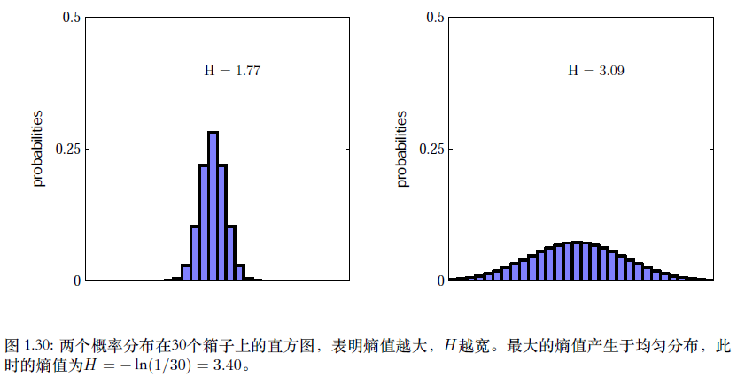
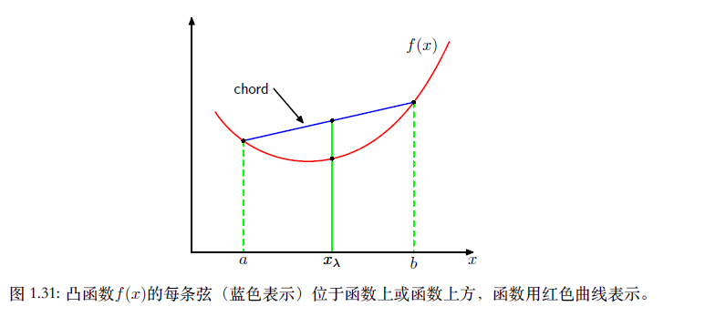

## 1.6 PRML 信息论

信息内容的度量以来于某个概率分布$p(x)$。为了表达我们接受到的信息，我们寻找一个函数$h(x)$,它是概率$p(x)$的单调函数。如果我们有两个不相关的事件$x$和$y$那么我们观察到两个事件同时发生接收到的**信息之和**为
$$
h(x,y)=h(x)+h(y)
$$
而两个事件的概率关系：
$$
p(x, y) = p(x)p(y)
$$
可以看出概率关系和信息量的多少有一定的对数关系，因此：
$$
h(x)-log_2p(x)
$$
其中负号保证了信息为正数或者是零。不难看出，概率越低（不确定性越大）信息量越多（大），$h(x)$的单位是比特（bit，binary digit）
接着，我们用熵来评价整个随机变量x平均的信息量，而平均最好的量度就是随机变量的期望，即熵的定义如下：
$$
H[x]=-\sum_{x}p(x)log_2p(x)
$$

| header 1 | 1    | 2    | 3    | 4    | 5    | 6    | 7    | 8    |      |
| -------- | ---- | ---- | ---- | ---- | ---- | ---- | ---- | ---- | ---- |
| 随机变量 | a    | b    | c    | d    | e    | f    | g    | h    |      |
| 状态     | 1/2  | 1/4  | 1/8  | 1/16 | 1/64 | 1/64 | 1/64 | 1/64 |      |

根据公式可以计算出熵为2bit

从现在开始，我们会将熵的定义中的对数变成自然对数，这种情况下，熵的度量的单位是nat，而不是bit。两者的差别是⼀个ln 2的因子。

如上图所示，如果分布$p(x_i)$在几个值周围有尖锐的峰值，熵就会相对降低，如果相对平稳地跨过许多值，那么熵就会很高。

### 1.6.1 相对熵和互信息

我们已经知道了，**信息熵是衡量随机变量或者整个系统的不确定性，不确定性越大，熵越大，呈正相关关系**。

每一个系统都会有一个真实的概率分布，我们根据真实的概率分布找到一个最优的策略，以最小的代价消除系统的不确定性，这个"大小"就是信息熵。而如果我们以非真实的分布来选择策略来消除系统的不确定性，这个"大小"就是交叉熵。
$$
\sum_{k=1}^Np_k\log_2\frac{1}{q_k}
$$

其中$p_k$表示真实分布，而$q_k$表示非真实分布。**交叉熵越低，则策略越好**，所以在机器学习中，我们需要最小化交叉熵，这样我们的策略才会越接近最优策略。

我们又如何去衡量不同策略之间的差异呢？**相对熵**，顾名思义，**相对熵是用来衡量两个取值为正的函数或概率分布之间的差异**

$$
KL(p||q)=-\int p(x)\ln q(x) \mathrm{d}x - (-\int p(x)\ln p(x) \mathrm{d}x) \\\\
KL(p||q)= -\int p(x)\ln\{\frac{q(x)}{p(x)}\}\mathrm{d}x
$$
这被称为分布p(x)和分布q(x)之间的**相对熵（relative entropy）**，或者叫KL散度（Kullback and Leibler, 1951）。相对熵不是一个对称量，即$KL(p||q) \neq  KL(q||p)$

- 先介绍凸函数（convex function）的概念

如果⼀个函数具有如下性质：每条弦都位于函数图像或其上⽅（如下图所⽰），那么我们说这个函数是凸函数。

如图所示，我们可以将位于$[a, b]$之间的任何一个$x$的值都可以写成$\lambda a+(1-\lambda)b$，其中$0\leq \lambda \leq 1$，弦上对应的点可以写成$\lambda f(a)+(1-\lambda)f(b)$。函数对应的值可以写为$f(\lambda a + (1-\lambda)b)$。所以凸函数具有以下的性质：

$$
f(\lambda a + (1-\lambda)b)\leq\lambda  a+(1-\lambda)b   
$$

**典型的凸函数有:** $x^2$，$x\ln x (x>0)$

现在要证明，$KL$散度满足$KL(p||q)\geq0$，并且当且仅当$p(x)=q(x)$时等号成立。

使用归纳法，可以证明凸函数满足：

$$
f(\sum^M_{i=1}\lambda_i x_i)\leq \sum^M_{i=1}\lambda_if(x_i)
$$

如果将$\lambda_i$看成取值为${x_i}$的**离散变量**$x$的概率分布，那么上面的公式可以写成:

$$
f(E[x])\leq E[f(x)]
$$

就是Jensen不等式，即函数的期望大于期望的函数。

对**连续变量**，Jensen不等式的形式为
$$
f(\int xp(x)\mathrm {d}x) \leq \int f(x)p(x)\mathrm {d}x
$$

那么对$KL$散度，我们有:

$$
KL(p||q)=-\int p(x)\ln{\frac{q(x)}{p(x)}}\mathrm{d}x \geq -\ln \int q(x) \mathrm{d}x=0
$$

因为$-\ln x$是凸函数。又因为归一化条件$\int q(x) \mathrm{d}x=1$，$-lnx$是严格凸函数，因此只有$q(x)=p(x)$对于所有的$x$都成立时，等号成立

因此我们可以把Kullback-Leibler散度看做两个分布$p(x)$和$q(x)$之间不相似程度的度量

假设数据通过未知分布$p(x)$生成，我们想要对$p(x)$建模。我们可以试着使用⼀些参数分布$q(x|\theta)$来近似这个分布。确定$\theta$的方式是最小化$p(x)$和$q(x|\theta)$之间关于$\theta$的$KL$散度。但事实上，我们并不知道$p(x)$，不过我们想到：

*如果我们给定有限数量的N个点，这些点满足某个概率分布或者概率密度函数，那么期望可以通过求和的方式估计。*
$$
E[f] \simeq  \frac{1}{N}\sum f(x_n)
$$

**所以**，假设我们已经观察到服从分布$p(x)$的有限数量的训练点$x_n$，其中$n=1,...,N$，那么根据上述公式近似，即：
$$
KL(p||q) \simeq \frac{1}{N}\sum^N_{n=1}\{-\ln q(x_n|\theta)+\ln p(x_n)\}
$$

可以看出，该公式的第二项和$\theta$无关，第一项是$\theta$的负对数似然函数，我们对该公式最小化，就是最大化似然函数。

**下面考虑两个变量组成的数据集**

$p(x,y)$给出两个变量$x$和变量$y$组成的数据集。如果变量的集合是独立的，那么他们的联合分布可以分解为边缘分布的乘积$p(x,y)=p(x)p(y)$。**但是如果变量不独立**，那么我们可以通过考察联合概率分布与边缘概率分布乘积之间的$\mathrm{KL}$散度来判断他们是否"接近"于相互独立。此时，$\mathrm{KL}$散度为：

$$
I[x,y]=\mathrm{KL}(p(x,y)||p(x)p(y))= -\iint p(x,y)\ln(\frac{p(x)p(y)}{p(x,y)})\mathrm{d}x\mathrm{d}y
$$

这被称为变量$x$和变量$y$之间互信息（mutual information）。根据$\mathrm{KL}$散度的性质，可以看到$I[x,y]\geq 0$，当且仅当$x$和$y$相互独立时等号成立。使⽤概率的加和规则和乘积规则，我们看到互信息和条件熵之间的关系为：
$$
I[x,y]=H[x]-H[x|y]=H[y]-H[y|x]
$$

**因此我们可以把互信息看成由于知道y值而造成的x的不确定性的减小（反之亦然）**。从贝叶斯的观点来看，我们可以把$p(x)$看成x的先验概率分布，把$p(x | y)$看成我们观察到新数据$y$之后的后验概率分布。因此互信息表示⼀个新的观测$y$造成的$x$的不确定性的减小。

